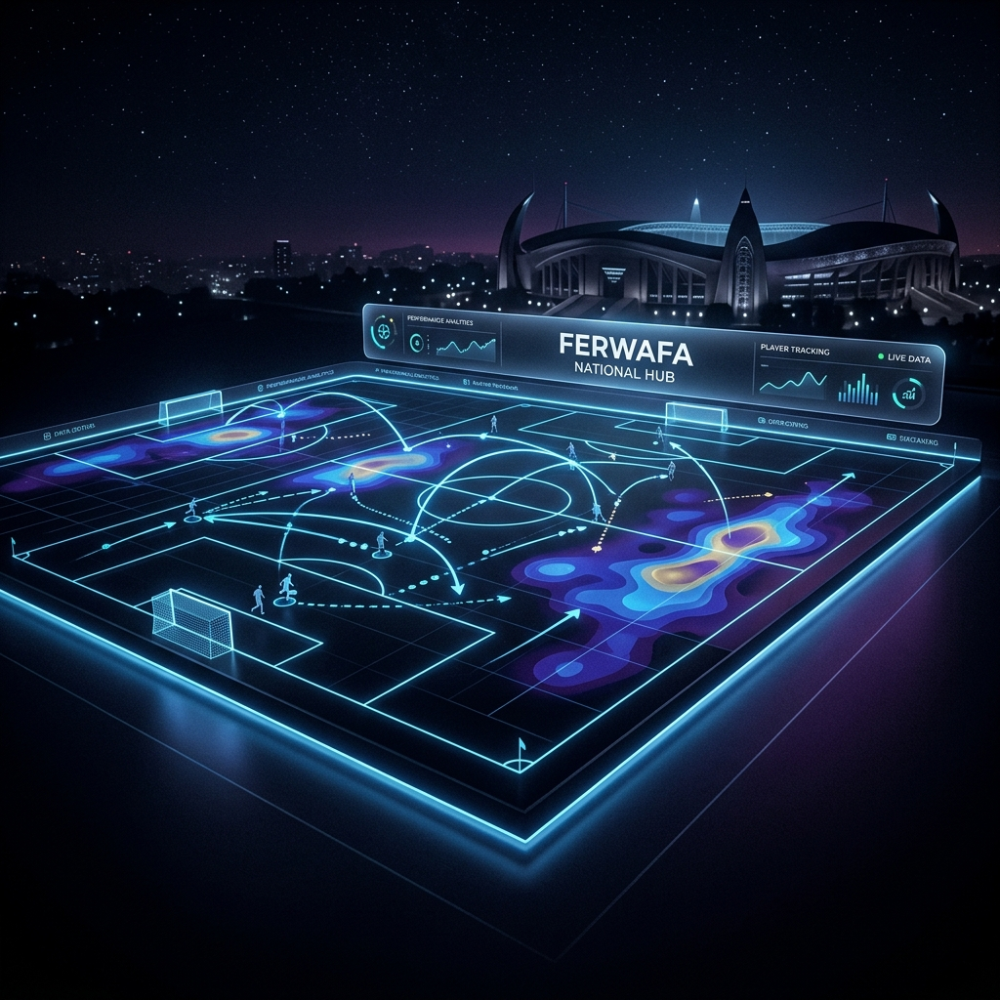

# ⚡ FERWAFA National Football Intelligence Hub



[](https://www.python.org/)
[](https://fastapi.tiangolo.com/)
[](https://ultralytics.com/)
[](#)

A state-of-the-art national football management and intelligence platform designed for the **Rwanda Football Federation (FERWAFA)**. This system integrates real-time AI performance metrics, ecosystem-wide governance, and advanced scouting capabilities into a unified, premium digital experience.

---

## 🚀 Key Features

### 🏟️ Unified Match Command Center
*   **Real-time Analytics**: Live match tracking via WebSockets with sub-second latency.
*   **Tri-Mode Streaming**: Integrated live video feeds with synchronized AI overlays.
*   **VAR-Style Corrections**: Manual event logging and AI verification for data integrity.

### 🤖 AI Pitch Machine
*   **Computer Vision**: YOLOv8-powered player detection and tracking.
*   **Performance Intelligence**: Automated detection of goals, possession, and player heatmaps.
*   **Jersey Recognition**: Advanced HSV-distance tracking for home/away team identification (including shirt and socks).
*   **Edge Processing**: Standalone desktop application with a native GUI (built with PyWebView).

### 🏛️ National Ecosystem Governance
*   **Multi-Role Access**: Dedicated dashboards for FERWAFA Officials, Clubs, Schools, Academies, and Scouts.
*   **Fixture Engine**: Automated Round-Robin scheduling for national leagues and youth tournaments.
*   **Player Ledger**: Comprehensive national registry with performance history and talent metrics.

### 🛡️ Enterprise-Grade Security
*   **HMAC Signing**: All data ingested from AI Machines is verified with shared secrets.
*   **Role-Based Access Control (RBAC)**: Strict isolation between entity data and administrative oversight.
*   **Edge Data Privacy**: The AI Pitch Machine only transmits anonymized JSON coordinate data. No raw video streams ever leave the stadium premise, ensuring 100% privacy compliance.
*   **System Integrity**: Built-in verification for localized executables with guided security bypass instructions for enterprise deployment.

---

## 🛠️ Technology Stack

| Component | Technology |
| :--- | :--- |
| **Backend** | Python 3.10+, FastAPI, SQLAlchemy |
| **Database** | MySQL / PostgreSQL |
| **AI/ML** | YOLOv8 (Ultralytics), OpenCV, NumPy |
| **Frontend** | Vanilla JavaScript, Advanced CSS3 (Neon-Atomic Design) |
| **Real-time** | WebSockets (Socket.io/FastAPI WS) |
| **Packaging** | PyInstaller, PyWebView (Desktop Control Panel) |

---

## 📦 Installation & Setup

### 1. Prerequisites
*   Python 3.10 or higher
*   MySQL/PostgreSQL Server
*   [YOLOv8 Weights](https://github.com/ultralytics/assets/releases/download/v8.1.0/yolov8n.pt) (placed in root)

### 2. Environment Setup
```bash
# Clone the repository
git clone https://github.com/heritier2004/ferwafa-national-hub.git
cd ferwafa-national-hub

# Install dependencies
pip install -r backend/requirements.txt
pip install -r ai_machine/requirements.txt
```

### 3. Database Initialization
```bash
python seed_db.py
```

### 4. Launching the System
You can start the entire ecosystem (Backend + AI Machine) using the provided starter scripts:

**Windows:**
```powershell
./RUN_SYSTEM.bat
```

**Universal (Python):**
```bash
python RUN_ALL.py
```

---

## 🖥️ Directory Structure

```text
├── ai_machine/         # Standalone AI analysis engine (Desktop App)
├── backend/            # FastAPI Core API & Websockets
│   └── app/            # Feature-based modular architecture
├── frontend/           # High-fidelity web dashboards
│   ├── assets/         # UI tokens, images, and brand assets
│   └── pages/          # Entity-specific views (Club, FERWAFA, etc.)
├── database/           # Schema migrations and migrations
├── yolov8n.pt          # YOLO detection model
└── RUN_ALL.py          # Unified system launcher
```

---

## 🎨 UI/UX Philosophy
The platform utilizes a **"Cyber-Athletic"** design language, combining high-contrast neon accents with dark-mode elegance. Every interaction is optimized for high-pressure matchday environments, ensuring that critical data is always visible and actionable.

---

## 📄 License
This system is developed for the exclusive use of the **Rwanda Football Federation (FERWAFA)**. All rights reserved.

---
*Built with ❤️ for the future of Rwandan Football.*
